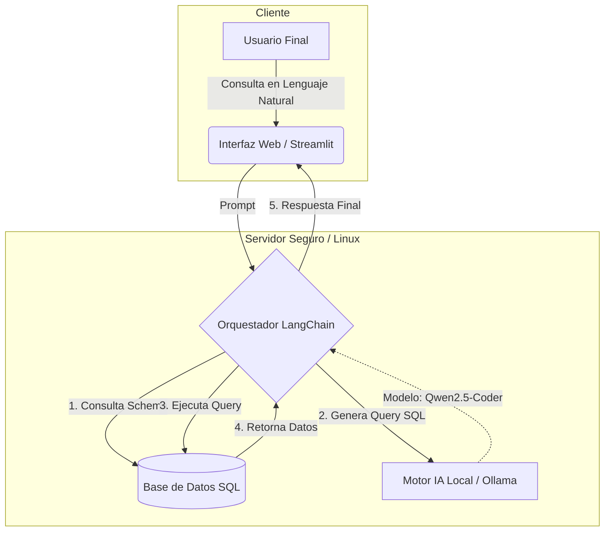

# 🏥 Sistema de Asistencia Hospitalaria Basado en IA Generativa


> **Proyecto de Título - Ingeniería en Informática**
> **Institución:** Hospital Clínico Magallanes (Contexto Aplicado)
> **Estado:** Prototipo Funcional (MVP)

---

## 📖 Descripción del Proyecto

Demo AsistenceAI es una solución de **Inteligencia Artificial asistencial** diseñada para mejorar la interacción entre el personal médico y los pacientes en entornos hospitalarios. Utiliza **RAG (Retrieval‑Augmented Generation)** para responder consultas clínicas, acceder a bases de datos de historiales médicos y proporcionar información relevante en tiempo real. El agente permite preguntas en lenguaje natural que se traducen a consultas SQL seguras, ofreciendo respuestas precisas sin alucinaciones.

---

## 🛡️ Privacidad y Seguridad (On‑Premise)

- **Despliegue on‑premise**: Todos los componentes (modelos de lenguaje, bases de datos y servicios) se ejecutan dentro de la infraestructura del hospital, garantizando que los datos sensibles nunca abandonen el perímetro de la red.
- **Cifrado en reposo y en tránsito**: TLS 1.3 para la comunicación entre micro‑servicios y cifrado AES‑256 para el almacenamiento de datos.
- **Control de acceso basado en roles (RBAC)**: Sólo el personal autorizado puede acceder a la API y a la interfaz de usuario.
- **Auditoría y logs**: Cada interacción se registra con timestamps y el ID del usuario para cumplir con normativas como HIPAA y GDPR.

---

## 🏗️ Arquitectura del Sistema



- **UI**: Interfaz web construida con **Streamlit**.
- **API**: Servidor **FastAPI** que orquesta la lógica de negocio.
- **LLM**: Modelo de lenguaje local (Ollama) para generación de respuestas.
- **Vector Store**: FAISS para búsquedas semánticas.
- **Base de datos**: PostgreSQL gestionado con **SQLAlchemy**.

---

## 🛠️ Stack Tecnológico

| Capa | Tecnologías |
|------|-------------|
| **Frontend** | Streamlit, HTML/CSS, JavaScript |
| **Backend** | FastAPI, Python 3.11, LangChain |
| **LLM** | Ollama (modelos locales) |
| **Vector Store** | FAISS |
| **Base de datos** | PostgreSQL + SQLAlchemy |
| **Infraestructura** | Docker, Docker‑Compose, Fedora/Ubuntu, Oracle Cloud |

---

## 🚀 Instalación y Despliegue

```bash
# Clonar el repositorio
git clone https://github.com/cristiansebastianahern/demo.asistenceAI.git
cd demo.asistenceAI

# Crear y activar entorno virtual
python -m venv .venv
source .venv/bin/activate

# Instalar dependencias
pip install -r requirements.txt

# Configurar variables de entorno (ejemplo)
cp .env.example .env
# Editar .env con credenciales y rutas adecuadas

# Levantar los servicios con Docker‑Compose
docker compose up -d

# Iniciar la aplicación Streamlit
streamlit run src/app.py
```

> **Nota**: Para entornos de producción, utilice `docker compose -f docker-compose.prod.yml up -d` y configure un proxy inverso (NGINX) con TLS.

---

## 🖥️ Uso

1. Acceda a la UI en `http://localhost:8501`.
2. Inicie sesión con sus credenciales institucionales.
3. Introduzca su consulta clínica en el cuadro de texto.
4. La IA recuperará información relevante del historial del paciente y generará una respuesta basada en evidencia.

---

## 👤 Autor

**Cristian Sebastian Ahern Ruiz** – Administrador de Infraestructura de Redes y Telecomunicaciones, Hospital Clínico Magallanes

📧 **Contacto**: cristiansebastian.ahern@alumnos.ulagos.cl 

🔗 **GitHub**: [@cristiansebastianahern](https://github.com/cristiansebastianahern)

Desarrollado con ❤️ en **Fedora Linux**, **Ubuntu Server Linux** & **Oracle Cloud**.
